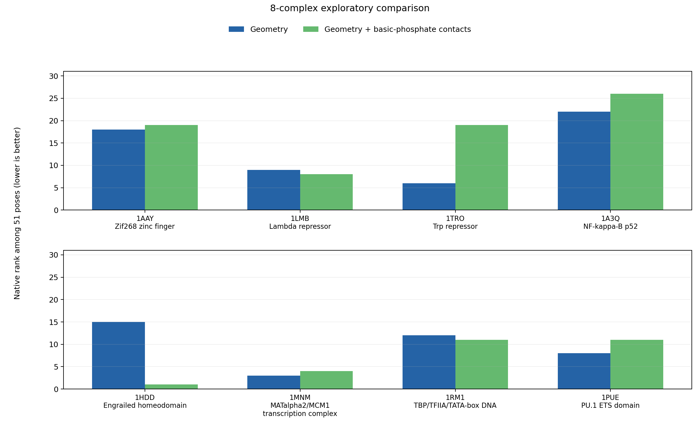
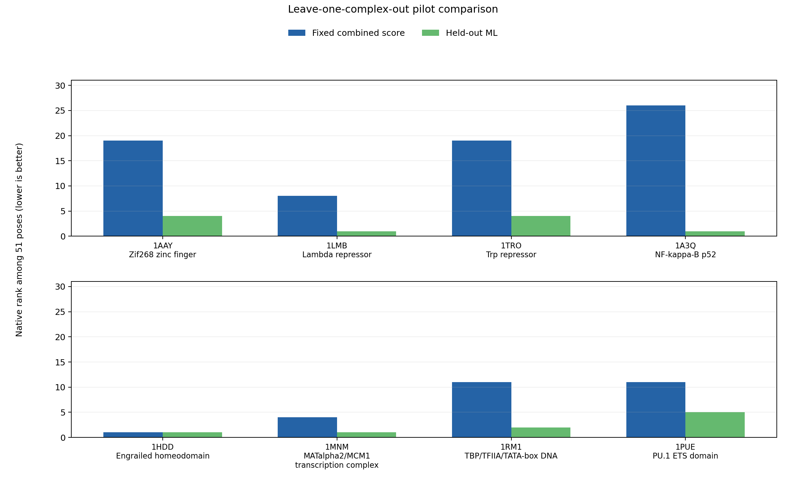

# ElectroPatch

**A reproducible, exploratory comparison of protein–DNA interface descriptors across eight crystal structures.**

[](https://colab.research.google.com/github/smaiti7/electropatch/blob/main/colab/ElectroPatch_Comparison.ipynb)

ElectroPatch creates 50 deterministic rigid-body DNA decoys per structure, scores four interpretable interface descriptors, and ranks the experimental pose among 51 candidates. It compares a fixed combined heuristic with a geometry-only ablation. An optional logistic model is evaluated by leaving **one entire complex** out at a time. This is a software and scientific-method pilot using synthetic decoys, not a validated docking predictor or an electrostatic energy calculation.



## Results

Each rank below is within one complex's 51-pose candidate set; lower is better. Scores standardized within one complex are not compared across complexes. The ML rank comes from a model trained on the other seven complexes.

| PDB and system | Geometry | Combined | Held-out ML |
| --- | ---: | ---: | ---: |
| [1AAY](https://www.rcsb.org/structure/1AAY) Zif268 zinc finger | 18 | 19 | 4 |
| [1LMB](https://www.rcsb.org/structure/1LMB) Lambda repressor | 9 | 8 | 1 |
| [1TRO](https://www.rcsb.org/structure/1TRO) Trp repressor | 6 | 19 | 4 |
| [1A3Q](https://www.rcsb.org/structure/1A3Q) NF-kappa-B p52 | 22 | 26 | 1 |
| [1HDD](https://www.rcsb.org/structure/1HDD) Engrailed homeodomain | 15 | 1 | 1 |
| [1MNM](https://www.rcsb.org/structure/1MNM) MATalpha2/MCM1 transcription complex | 3 | 4 | 1 |
| [1RM1](https://www.rcsb.org/structure/1RM1) TBP/TFIIA/TATA-box DNA | 12 | 11 | 2 |
| [1PUE](https://www.rcsb.org/structure/1PUE) PU.1 ETS domain | 8 | 11 | 5 |

The fixed combined score puts **2/8** natives in the top five (median rank 11). The held-out model puts **8/8** in the top five (median rank 1.5) on these deliberately generated decoys. The result shows that a simple model can exploit patterns in this restricted task; it does **not** establish accuracy on independent structures, realistic docking poses, or binding affinities. The positive class has only eight examples, the decoy scheme is shared across groups, and the ML experiment was added after inspecting the original systems. The model's probability is a ranking score, not a calibrated chance that a pose is experimentally native.



Read the [scientific analysis](docs/ANALYSIS.md) for failures, chain choices and limitations. The [reproducibility record](docs/REPRODUCIBILITY.md) lists the commands, versions, input and output hashes, and execution history.

## Run in Colab

After publishing this repository, open the badge above, select **Runtime → Run all**, and paste the public repository URL. The notebook installs the package, verifies the frozen PDB checksums, runs both comparisons, shows both figures plus per-complex plots, and offers a ZIP download. No GPU is needed. The notebook calls this repository's code.

## Run locally

From the repository root with Python 3.10 or newer:

```bash
python -m venv .venv
source .venv/bin/activate
python -m pip install -e '.[ml]'
python -m unittest discover -s tests -v
electropatch compare
electropatch ml
```

The package without the optional `[ml]` extra still supports `electropatch compare` and `electropatch run`. `electropatch ml` reads the existing comparison files, so run `compare` first. Outputs are under `results/` and `figures/`. A single-complex example is `electropatch run --pdb-file data/1AAY.pdb --protein A --dna B,C --output-dir /tmp/electropatch-single`.

## Method in brief

Selected PDB author chains, X-ray resolution, source URLs and SHA-256 hashes are frozen in [`data/manifest.csv`](data/manifest.csv). The parser uses first-model `ATOM` heavy atoms and excludes `HETATM`. For each pose, the features are heavy-atom contacts ≤4.5 Å, clashes ≤2.0 Å, Lys/Arg nitrogen to DNA phosphate oxygen contacts ≤4.5 Å, and mean nearest protein distance over all DNA heavy atoms. The fixed score is `z(contacts) − 2 z(clashes) + z(basic-phosphate contacts) − z(mean nearest distance)`, with z-scores calculated separately within each pose set.

The optional ML analysis uses the four raw descriptors, divides the three count features by the number of DNA heavy atoms, and fits `StandardScaler` plus class-balanced logistic regression. `LeaveOneGroupOut` groups by PDB ID; scaler and model fitting use seven complexes and score the eighth. No tuning, feature selection, or probability calibration is performed on held-out complexes.

## Repository map

- `src/electropatch/`: structure parser, decoy generator, scoring, grouped ML and CLI.
- `data/`: eight frozen PDB files and the checksum/chain manifest.
- `results/`, `figures/`: committed outputs from the exact run described in the reproducibility record.
- `colab/`: online notebook and instructions.
- `docs/`: detailed analysis and separate reproducibility record.
- `tests/`, `.github/workflows/test.yml`: local and CI checks.
- [`ELECTROSTATICS_ROADMAP.md`](ELECTROSTATICS_ROADMAP.md): a later Poisson–Boltzmann study, with preparation and sensitivity work.

## Limits and publication

These decoys are rigid perturbations and can clash; their difficulty varies with interface size and shape. All eight natives have zero ≤2 Å clashes, a strong artificial cue the model may exploit. The eight structures are selected examples, not a representative, independent benchmark. Biological assemblies, missing interface atoms, cofactors and protonation have not been fully curated. The basic-phosphate feature is a geometric proxy, not a Poisson–Boltzmann potential, free energy or explicit electrostatic calculation.

The code is MIT licensed. PDB coordinates are credited through the RCSB links and frozen source URLs. Follow [GITHUB_UPLOAD.md](GITHUB_UPLOAD.md) to review your author details, verify, and publish the repository.
